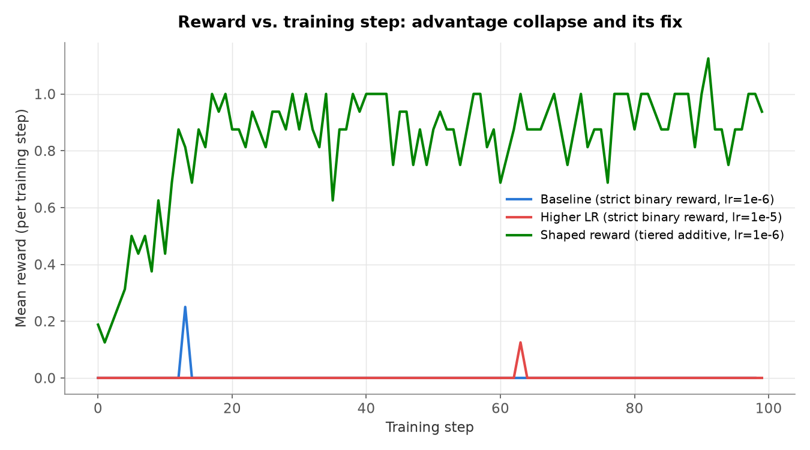
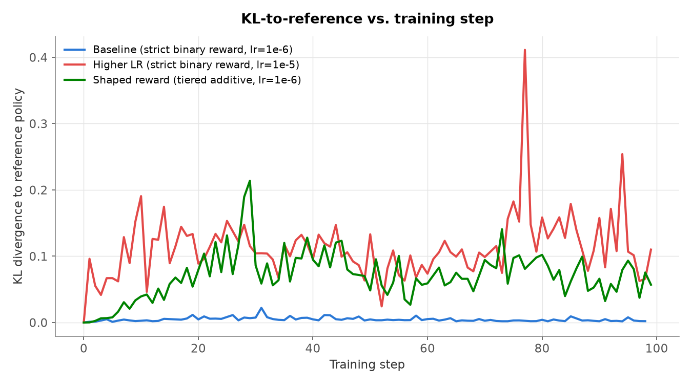
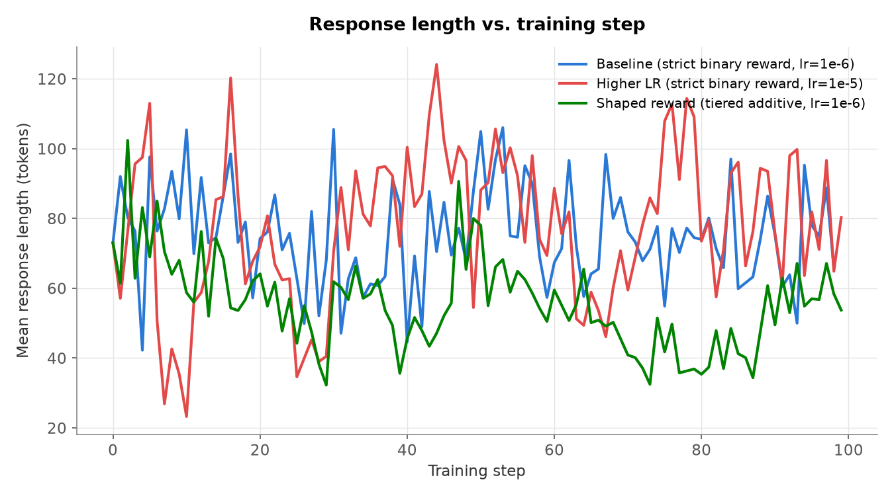

# GRPO / RLVR Reasoning Trainer

From-scratch implementation of the DeepSeek-R1-Zero recipe: GRPO
(group-relative advantages, no critic) + rule-based verifiable rewards
(RLVR), trained on Countdown starting from a Qwen2.5-0.5B base checkpoint.

Built entirely locally on an Apple Silicon M2 Pro Mac (16GB unified memory,
PyTorch MPS backend) - not a rented cloud GPU, as the original plan assumed.
Zero cloud spend across the whole project.

## Status
- [ ] M1: Reference repo (McGill-NLP/nano-aha-moment) reproduced - **skipped**. No GPU rental budget for this project; all work was done on a single local M2 Pro Mac instead. This is a deliberate scope cut, not an oversight - see "Out of scope" below.
- [x] M2: Countdown + GSM8K verifiers implemented, unit-tested (`tests/test_*_verifier.py`, `tests/test_countdown_dataset.py`, `tests/test_format_reward.py`)
- [x] M3: Own GRPO loop (`grpo/`) trains stably - see "Results" below (shaped-reward validation run: reward rises from 0.19 to a 0.7-1.0 plateau over 100 steps, KL bounded, `clip_frac` 0.0 throughout)
- [x] M4: Trained checkpoint changes measurably vs. base - see "Results" below (base fails to produce valid output format at all; trained checkpoint hits perfect format compliance, though not yet genuine numeric correctness - reported honestly, not oversold)
- [x] M5: Test-time scaling curve + cost report - see "Results" below

54/54 unit tests pass (`pytest tests/ -v`).

## Method

1. **Rollouts** (`grpo/rollout.py`): grouped sampling via HF `generate` - `group_size=4` completions per prompt, 2 prompts/step (8 rollouts/step total).
2. **Reward** (`rewards/countdown_verifier.py`, `rewards/gsm8k_verifier.py`, `rewards/format_reward.py`): rule-based, format + correctness, no learned reward model, unit-tested against edge cases. Countdown arithmetic is checked with an `ast`-sandboxed evaluator - **no `eval()` is ever run on raw model text**.
3. **Advantage** (`grpo/advantage.py`): `A_i = (r_i - mean(group)) / (std(group) + eps)`, with explicit handling for the zero-variance case (every sample in a group scores identically) - this case turned out to be the central finding of the project; see below.
4. **Objective** (`grpo/loss.py`): clipped PPO-style surrogate on the group-relative advantage, plus a Schulman k3 KL penalty to a frozen reference policy - no value/critic network, which is GRPO's core simplification over PPO.
5. **Training loop** (`grpo/trainer.py`, `scripts/train.py`): wires rollout → reward → advantage → loss → optimizer step; W&B offline logging with a JSONL fallback; fp16 checkpointing.
6. **Eval** (`eval/evaluate.py`, `eval/scaling_curve.py`): held-out accuracy before/after training, plus pass@k and majority-vote@k test-time scaling.
7. **MPS memory management**: `torch.mps.empty_cache()` + explicit tensor cleanup + `gc.collect()` every step, fp16 checkpoint saving (halves checkpoint disk size). Required to keep a 0.5B-parameter RL training loop (policy + reference model + optimizer state + rollout buffers) inside 16GB of unified memory.

## The central finding: advantage collapse

Three training runs were run on Countdown with Qwen2.5-0.5B (base, non-instruction-tuned):

| Run | Reward fn | LR | Steps | Wall-clock | Result |
|---|---|---|---|---|---|
| Smoke test | strict binary (0/1) | 1e-6 | 30 | ~53 min | reward flat at 0.0 the whole time |
| Baseline | strict binary (0/1) | 1e-6 | 100 | ~62 min | reward flat at 0.0 (one isolated spike to 0.25 at step 13, reverted immediately) |
| Higher-LR | strict binary (0/1) | 1e-5 | 100 | ~3.1 hrs (1 crash+restart, MPS OOM) | reward still flat (one smaller spike to 0.125 at step 63) - but **worse**: sustained KL 20-40x higher than baseline (0.06-0.4 vs baseline's ~0.005 peak), 3 grad_norm spikes (steps 15/72/77, one reaching ~11544), final checkpoint output degenerate (repetitive `<think>` loops) |




Raw per-step metrics (reward, KL, response length, grad norm, loss) for
each of the three runs charted above are in `results/*_metrics.csv`.

**Root cause**, confirmed via research against reference-implementation source
(McGill-NLP/nano-aha-moment, Jiayi-Pan/TinyZero, policy-gradient/GRPO-Zero,
huggingface/open-r1) and the literature (arXiv 2605.21125, "Advantage
Collapse in GRPO," ICML 2026): GRPO's group-relative advantage
`(r-mean)/(std+eps)` is **mathematically exactly zero** whenever every
sample in a group scores identically - which is near-guaranteed with a
strict binary {0,1} reward, a small group size (4), and a 0.5B base model
that rarely produces a fully-correct completion. Raising the learning rate
does not fix this: it just destabilizes an already-zero gradient signal
(confirmed empirically - the higher-LR run was strictly worse, not better,
across every metric except a marginally larger accidental reward spike).
Reference implementations avoid this by using much larger sampling budgets
(nano-aha-moment: 64 rollouts/step; DeepSeekMath's original GRPO:
1024/step, vs. this project's 8/step) **and** partial-credit/tiered
rewards, not strict binary. TinyZero's own documentation states Qwen2.5-0.5B
fails to learn reasoning in their pipeline at all - it works only ≥1.5B -
indicating part of what was observed here may also reflect a real
capability ceiling of this tiny model, not purely the collapse bug.

**The fix**: reward functions were changed from strict binary to an
additive tiered scheme (matching nano-aha-moment's verified design):
`format_reward` now returns 0.0 (wrong `<think>/<answer>` structure) / 0.5
(right structure, but `<answer>` content has disallowed characters) / 1.0
(right structure, all-allowed characters). `countdown_reward` /
`gsm8k_reward` = `format_tier + binary_correctness`, giving a reward range
of {0.0, 0.5, 1.0, 1.5, 2.0} instead of the old {0.0, 1.0}.

**Validation run - the fix worked**: 100 steps, `lr=1e-6` (the original
stable rate, not the unstable 1e-5), shaped reward, ~1h25m wall-clock
(after one MPS-OOM crash+restart - same transient host-memory-pressure
pattern as the higher-LR run, unrelated to the reward change). Reward rose
from **0.1875 at step 0 to a sustained plateau of 0.7-1.0** (out of max
2.0) by step ~13, held through step 99:

| Step | 0 | 13 | 25 | 50 | 63 | 75 | 99 |
|---|---|---|---|---|---|---|---|
| Reward | 0.1875 | 0.8125 | 0.8125 | 0.875 | 1.0 | 0.875 | 0.9375 |

KL stayed bounded throughout (max 0.214, settling 0.03-0.13, final 0.057) -
no explosion - and `clip_frac` was 0.0 for the entire run. `grad_norm` ran
persistently higher (5-14) than the old "quiet" 0.3-1.2 baseline; this is
the correct signature of real gradient signal finally flowing through a
nonzero advantage, not instability.

## Results

### Held-out evaluation (30 fresh Countdown puzzles, seed=999, disjoint from all training seeds, greedy decoding)

| Model | Strict accuracy (reward ≥ 2.0, i.e. genuinely correct) | Reward distribution |
|---|---|---|
| base Qwen2.5-0.5B | 0% | all 30/30 examples scored 0.0 - fails to produce valid format at all |
| trained (step_99, shaped-reward run) | 0% | all 30/30 examples scored 1.0 - perfect format every time, but wrong arithmetic every time |

A follow-up sanity check on 5 raw sample completions from the trained
checkpoint confirmed the model genuinely engages with each puzzle's
distinct numbers (not literal copy-paste boilerplate), but applies a
near-fixed operator template (`num1 + num2 - num3 * num4`, numbers used in
their given order) rather than actually searching over different
orderings/operators - i.e. it learned the surface **format** skill, not
the underlying **combinatorial search** skill needed to solve Countdown.

### Test-time scaling curve (trained checkpoint, 10 held-out puzzles, seed=999, temperature=0.8)

| k | pass@k | majority-vote@k |
|---|---|---|
| 1 | 0.0 | 0.0 |
| 2 | 0.0 | 0.0 |
| 4 | 0.0 | 0.0 |
| 8 | 0.0 | 0.2 |

`pass@k` (the trustworthy metric - requires reward ≥ 2.0, i.e. genuine
numeric correctness) stayed exactly 0.0 at every k: zero numerically
correct answers across 80 total generations, confirming the model has not
learned to solve Countdown even with 8x sampling diversity. The
`majority-vote@8 = 0.2` figure is a confirmed **methodology artifact, not a
capability finding**: for Countdown, `majority_vote_at_k` compares the
model's raw, un-evaluated `<answer>` expression string against the bare
target number as a string; a genuinely correct solution *evaluates to* the
target but is essentially never textually identical to it, so this metric
can only register a "pass" via a degenerate non-attempt (the model
outputting just the bare number with no arithmetic). This limitation is
documented in code (`eval/scaling_curve.py`) with a regression test
(`test_majority_vote_at_k_cannot_detect_correct_countdown_expression`), and
does not apply to GSM8K, where the ground truth genuinely is the literal
final answer.



### Cost / compute

All work done locally on an Apple Silicon M2 Pro (16GB unified memory),
zero cloud spend. Total wall-clock across all training runs: smoke
(53 min) + baseline (62 min) + higher-LR (3.1 hrs) + shaped-reward
validation (1h25m) ≈ **6.5 hours of local GPU (MPS) time**, plus additional
time for eval/scaling-curve runs (~30-60 min each).

## Reproducing

```bash
pip install -e ".[dev]"
pytest tests/ -v   # 54 passed

# smoke test (30 steps, strict binary reward, demonstrates advantage collapse)
python scripts/train.py --config configs/countdown_qwen0.5b_smoke.yaml

# baseline (100 steps, strict binary reward, lr=1e-6 - flat reward)
python scripts/train.py --config configs/countdown_qwen0.5b_run100.yaml

# higher-LR ablation (100 steps, strict binary reward, lr=1e-5 - worse, not better)
python scripts/train.py --config configs/countdown_qwen0.5b_run100_lr1e5.yaml

# shaped-reward validation (100 steps, lr=1e-6, tiered reward - the fix that worked)
# reuses configs/countdown_qwen0.5b_run100.yaml: the reward-shaping change lives in
# rewards/countdown_verifier.py + rewards/format_reward.py, not in a config field
python scripts/train.py --config configs/countdown_qwen0.5b_run100.yaml --run_id shaped_reward_run

# held-out evaluation, base vs. trained
# (no CLI wrapper yet - eval/evaluate.py exposes evaluate_checkpoint()/aggregate_accuracy()
# as library functions; scripts/eval.py was intentionally not built this session, see
# "Out of scope" below)
python -c "
from data.countdown import build_countdown_dataset
from eval.evaluate import evaluate_checkpoint
ds = build_countdown_dataset(n_examples=30, seed=999)
print(evaluate_checkpoint('Qwen/Qwen2.5-0.5B', ds, 'countdown'))
print(evaluate_checkpoint('runs/<run_id>/checkpoints/step_99', ds, 'countdown'))
"

# pass@k / majority-vote@k scaling curve (same library-function pattern)
python -c "
from data.countdown import build_countdown_dataset
from eval.scaling_curve import build_scaling_curve
ds = build_countdown_dataset(n_examples=10, seed=999)
print(build_scaling_curve('runs/<run_id>/checkpoints/step_99', ds, 'countdown', ks=[1,2,4,8]))
"
```

If running on Apple Silicon with limited unified memory, set
`PYTORCH_MPS_HIGH_WATERMARK_RATIO=0.0` (see pitfalls below) to reduce the
risk of an MPS OOM crash mid-run.

## Out of scope / future work

- Reference-repo reproduction (M1) - no cloud GPU rental for this project; would revisit with rented compute.
- 7B+ models, multi-node training, the full multi-stage R1 pipeline (R1-Zero → cold-start SFT → reasoning RL → rejection sampling → final RL), learned reward models.
- vLLM rollout backend - HF `generate` used throughout; fine at this model/batch scale but would not scale to larger sampling budgets.
- `scripts/eval.py` CLI driver - `eval/evaluate.py` and `eval/scaling_curve.py` are fully built and unit-tested library functions, but a committed command-line wrapper around them was intentionally scoped out this session in favor of throwaway scripts for local-dev iteration; see "Reproducing" above for the direct function-call pattern used instead.
- GSM8K training run - the data/verifier pipeline is built and unit-tested (`tests/test_gsm8k_verifier.py`) but was not exercised end-to-end in a training run this session; only Countdown was trained.
- TRL `GRPOTrainer` baseline comparison - not run. The from-scratch implementation's correctness was instead validated via extensive independent code review (hand-traced advantage/loss math against reference implementations) plus the reward-shaping fix's clean empirical success, which is strong indirect evidence the core loop is correct.
- Genuine Countdown-solving capability at this scale was not reached: 0.5B params, 100 GRPO steps, group_size=4, 8 rollouts/step is consistent with TinyZero's own documented finding that 0.5B fails in their pipeline too. A larger model (1.5B+) or a much larger sampling budget (matching reference implementations' 64-1024 rollouts/step) would likely be needed to see genuine correctness emerge - "expecting too much from a tiny model" was a known risk going in.
- No "aha moment" (spontaneous backtracking language like "wait, let me re-check") was observed in this session's transcripts - plausible given the tiny model and step budget; would need a longer run or larger model to look for this.

## Common pitfalls hit during this project

- **Advantage collapse from strict binary rewards** (the central finding - see above). A binary {0,1} reward with a small group size and a base model that rarely gets things fully right drives the group-relative advantage to exactly zero for most groups, silently killing the gradient signal while every surface metric (loss is finite, no NaNs, training "runs") looks fine. Diagnosed by comparing three runs (varying LR alone did not help) and confirmed against reference-implementation source and the "Advantage Collapse in GRPO" literature (arXiv 2605.21125). Fixed by switching to an additive tiered/partial-credit reward, which reliably breaks group-score ties.
- **MPS OOM crash pattern**: both the higher-LR run and the shaped-reward validation run crashed once mid-run with an MPS out-of-memory error caused by transient host memory pressure (not a steady leak - restarting from checkpoint completed the run fine). Mitigated by setting `PYTORCH_MPS_HIGH_WATERMARK_RATIO=0.0` plus per-step `torch.mps.empty_cache()`, explicit tensor cleanup, and `gc.collect()`.
- **EOS-masking bug**: the completion mask used to compute log-probs and loss originally excluded the EOS token itself, which meant the policy never received gradient signal for correctly deciding *when to stop generating*. Fixed in `grpo/trainer.py` (commit `fb03d95`) by including the EOS token in the completion mask.
- **`inf*0 = nan` bug in the plan's own reference loss code**: the KL/clipping math in the original loss formulation, as sketched in the project plan, produced `nan` losses when a masked-out position multiplied an `inf`-valued term by a `0` mask - `inf * 0` is `nan` in IEEE float arithmetic, not `0`. Found and fixed in `grpo/loss.py` (commit `8870f0c`) by replacing the naive multiply-by-mask with `torch.where` so masked positions are excluded from the arithmetic entirely rather than zeroed after the fact.
- **Countdown puzzle-generator solvability bug**: the synthetic Countdown puzzle generator could produce puzzles with no valid solution under the allowed operator set, which is unfair to both the base and trained model and pollutes reward statistics. Found and fixed (commit `8870f0c`) by guaranteeing generator-side solvability - puzzles are now constructed by building a solvable expression first and deriving the puzzle from it, rather than sampling numbers and a target independently.
- **`majority_vote_at_k` methodology artifact for expression-based tasks**: on Countdown, comparing the model's raw un-evaluated `<answer>` text against the bare target number as a string means a textually-correct-looking "majority" can only arise from degenerate non-attempts, not genuine solutions - see "Results" above. Documented in code with a regression test rather than silently left as a misleading number; does not affect GSM8K, where the literal final-answer string is the correct comparison target.
- **Regex too strict for whitespace**: `format_reward`'s original regex for the `<think>...</think><answer>...</answer>` structure did not tolerate incidental whitespace between the two tags, which the model produces naturally. Fixed by relaxing the regex (commit `297ba29`); also increased `max_new_tokens` in the smoke config at the same time since generations were being truncated before the closing tag.
